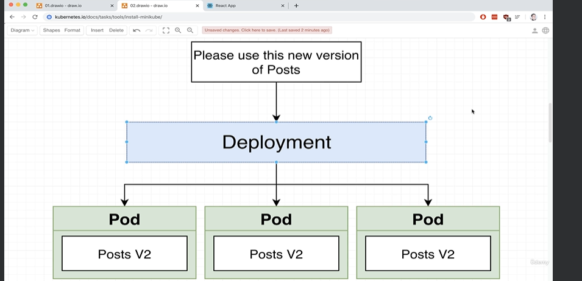
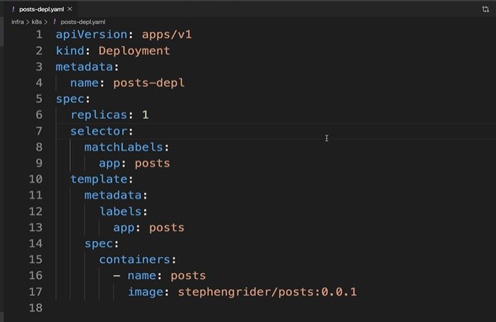
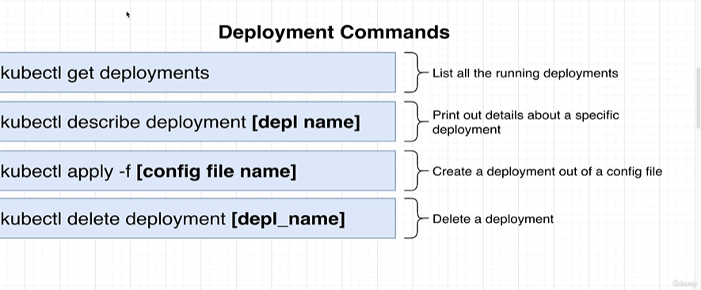
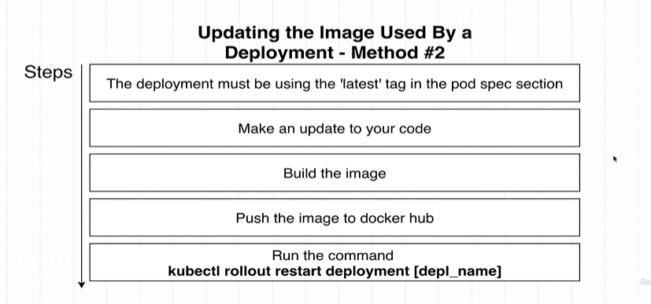
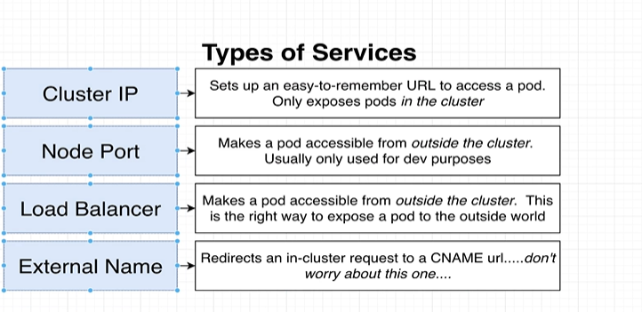
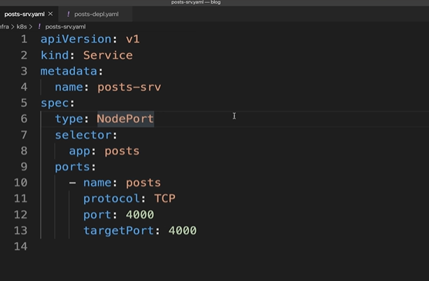
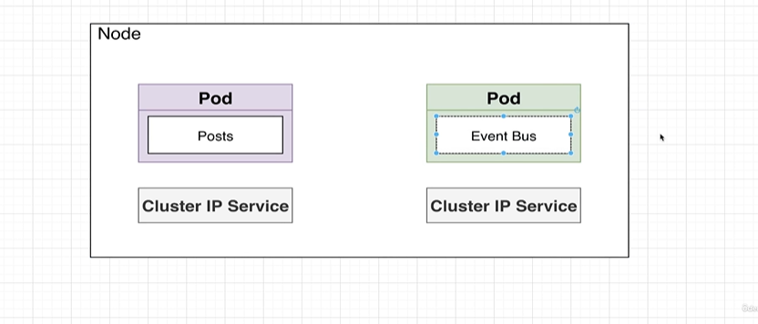
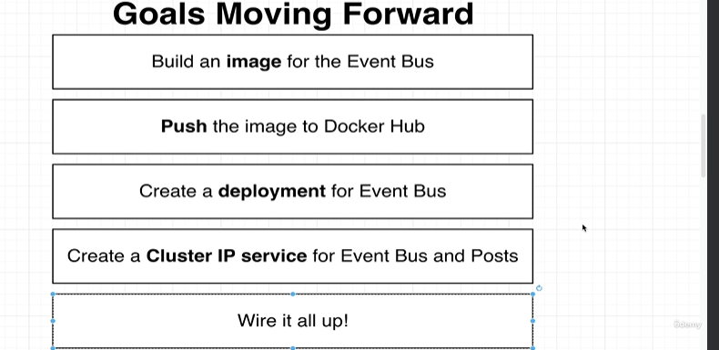
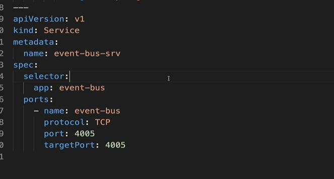
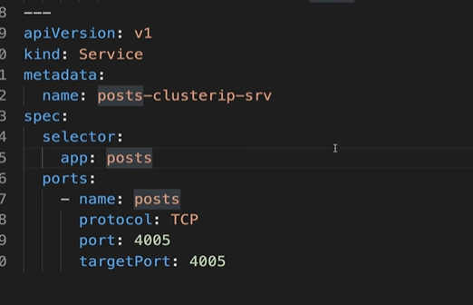

# 11 May

## Introducing deployments

1. Deployment manages the pods
   

## Creating deployments

1. create posts-depl.yaml in infra/k8s
   

2. Common Command around deployments
   

## Updating deployments

1. This is not the recommended way

- Make changes to source code.
- Build the docker image with updated version.
- Update the deployment yaml.
- Run kubectl apply -f command
- That's it.

2. Problem is we should not update the deployment file very often. Each time we make changes to the source code we have to change the version in deployment file.

## Preferred method for updating deployments

1. Here is the recommended way
   

2. Remove imageNever pull policy.

## Networking with services

1. 4 different types of services we need to be aware of
   

## Creating a NodePort service

1. Create posts-srv.yaml in k8s
   

## Accessing NodePort Service

1. run `kubectl apply -f posts-srv.yaml`

2. kubectl get services to check running services.

## Setting Up Cluster IP services

1. We currently have a pod with posts and we need to create event bus pod now.
   

## Building a deployment for event bus

1. This is the steps we need to complete
   

2. Build the image and push it to docker hub
3. `event-bus-depl.yaml` and copy from post file
4. Now use `kubectl apply -f event-bus-depl.yaml`

## Add Cluster IP service

1. To add multiple object in yaml file we must use `---`
2. If we do not specify the type then default is 'ClusterIp'
   
3. Final output
   

4. Update the post-depl as well
   

